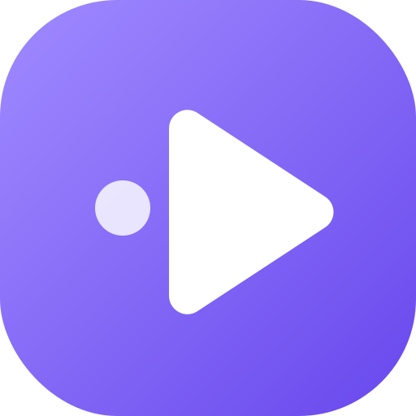
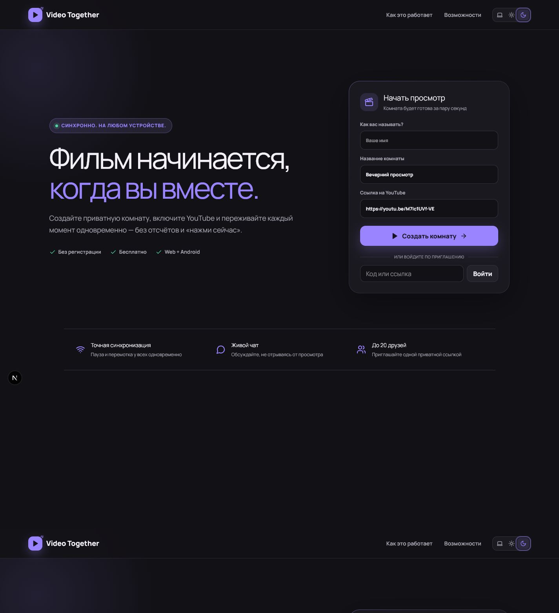
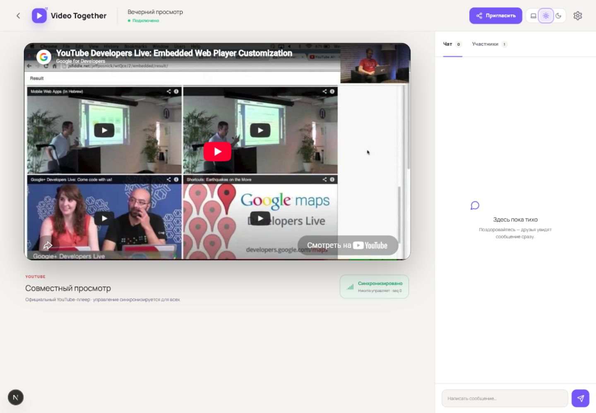
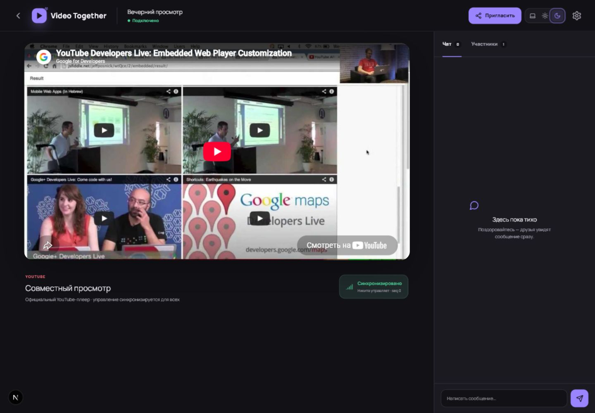
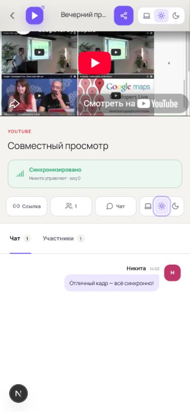
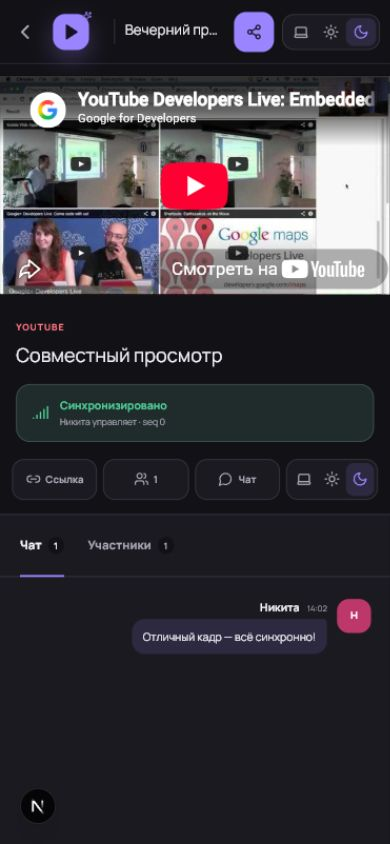
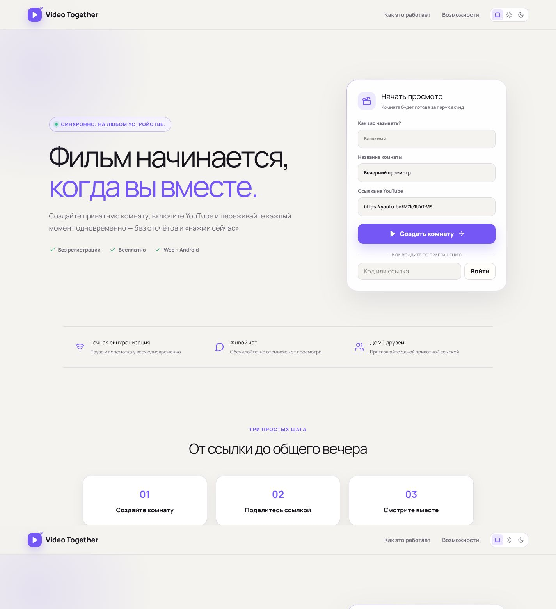
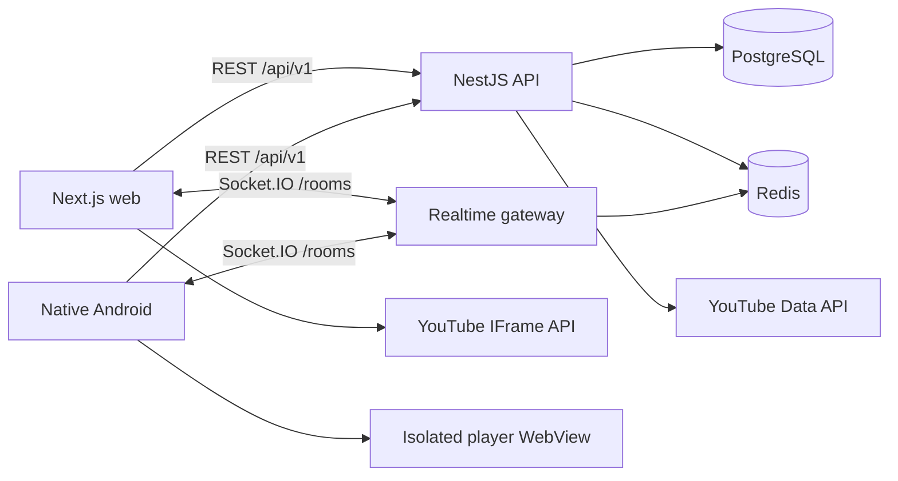

<div align="center">
  
  <h1>Video Together</h1>
  <p><strong>Синхронные YouTube-комнаты для друзей — в браузере и на Android.</strong></p>
  <p>Создайте комнату, отправьте приглашение и смотрите видео одновременно с общим управлением, участниками и живым чатом.</p>

  <p>
    
    
    
    
    
    
  </p>
</div>



## Возможности

- Гостевой вход без обязательной регистрации.
- Создание приватной комнаты и вход по ссылке-приглашению.
- Официальный YouTube IFrame Player — без проксирования или изменения контента.
- Общие действия `play`, `pause`, `seek` и смена видео.
- Серверная последовательность событий и восстановление snapshot после reconnect.
- Список участников, online-статусы, роли владельца, модератора и зрителя.
- Realtime-чат внутри комнаты.
- Светлая, тёмная и системная темы с сохранением выбора.
- Адаптивный web-интерфейс для desktop, tablet и mobile portrait.
- Нативная Android-архитектура на Kotlin и Jetpack Compose.
- Русская локализация по умолчанию и Android-ресурсы для английского языка.
- OpenAPI, AsyncAPI и JSON Schema для публичных контрактов.
- Docker Compose, PostgreSQL, Redis и Caddy-конфигурация.

## Интерфейс

### Комната на desktop

| Светлая тема | Тёмная тема |
|---|---|
|  |  |

### Комната на мобильном устройстве

| Светлая тема | Тёмная тема |
|---|---|
|  |  |

### Главная страница

<details>
  <summary>Показать светлую тему</summary>

  
</details>

## Как это работает

1. Клиент получает гостевую или Google-сессию через REST API.
2. Владелец создаёт комнату и делится постоянной ссылкой-приглашением.
3. Web или Android-клиент подключается к Socket.IO namespace `/rooms`.
4. Сервер отдаёт полный snapshot: текущее видео, позицию, состояние, участников и сообщения.
5. Команды управления получают серверное время и монотонный `sequence`.
6. Клиенты игнорируют устаревшие события и корректируют drift относительно серверной позиции.
7. После временного отключения клиент повторно входит в комнату и восстанавливается из свежего snapshot.



Подробнее: [архитектура](docs/ARCHITECTURE.md) и [алгоритм синхронизации](docs/SYNCHRONIZATION.md).

## Структура монорепозитория

```text
.
├── apps/
│   ├── web/                  # Next.js, React, Tailwind CSS, Socket.IO client
│   ├── api/                  # NestJS REST API и realtime gateway
│   └── android/              # Kotlin, Compose, Material 3, Hilt
├── packages/
│   ├── contracts/            # OpenAPI, AsyncAPI, JSON Schema
│   └── shared/               # Общие типы и sync-математика
├── infra/caddy/              # Reverse proxy и TLS routing
├── docs/                     # Архитектура, безопасность, эксплуатация
├── compose.yaml              # Локальная инфраструктура
└── compose.production.yaml   # Single-host production reference
```

## Технологии

| Область | Стек |
|---|---|
| Web | Next.js 16, React 19, TypeScript strict, Tailwind CSS 4, TanStack Query, Socket.IO Client, Vitest, Playwright |
| Backend | Node.js 22, NestJS 11, Socket.IO 4, Prisma, PostgreSQL, Redis, JWT, Swagger |
| Android | Kotlin, Jetpack Compose, Material 3, Hilt, StateFlow, Retrofit, OkHttp, AndroidX WebKit, Credential Manager, DataStore |
| Contracts | OpenAPI 3.1, AsyncAPI 3.0, JSON Schema 2020-12 |
| Infrastructure | Docker Compose, PostgreSQL, Redis, Caddy |

## Быстрый запуск

### Требования

- Node.js 22 или новее.
- pnpm 10.13.1 через Corepack либо `npx`.
- Docker Desktop — только если нужны PostgreSQL и Redis.

### Windows PowerShell

```powershell
git clone https://github.com/NikitaKHS/syncema.git
cd syncema
Copy-Item .env.example .env
corepack enable
corepack prepare pnpm@10.13.1 --activate
pnpm install
pnpm dev
```

Если встроенный Corepack не принимает актуальный ключ подписи pnpm:

```powershell
npx --yes pnpm@10.13.1 install
npx --yes pnpm@10.13.1 dev
```

### Linux / macOS

```bash
git clone https://github.com/NikitaKHS/syncema.git
cd syncema
cp .env.example .env
corepack enable
corepack prepare pnpm@10.13.1 --activate
pnpm install
pnpm dev
```

После запуска:

| Сервис | URL |
|---|---|
| Web | http://localhost:3000 |
| REST API | http://localhost:4000/api/v1 |
| Swagger UI | http://localhost:4000/docs |
| Health | http://localhost:4000/api/v1/health |
| Readiness | http://localhost:4000/api/v1/ready |

## Запуск через Docker

```bash
cp .env.example .env
docker compose up --build
```

Контейнеры:

- `web` — Next.js standalone server;
- `api` — NestJS API и Socket.IO;
- `postgres` — основное хранилище;
- `redis` — cache и realtime infrastructure.

Production reference:

```bash
docker compose -f compose.yaml -f compose.production.yaml up -d --build
```

Перед реальным развёртыванием прочитайте [DEPLOYMENT.md](docs/DEPLOYMENT.md).

## Переменные окружения

Скопируйте `.env.example` в `.env`. Секреты не должны попадать в Git.

| Переменная | Назначение | Нужна локально |
|---|---|---|
| `PORT` | Порт API | Нет, по умолчанию `4000` |
| `WEB_ORIGIN` | CORS allow-list web-клиента | Нет |
| `NEXT_PUBLIC_API_URL` | Публичный URL REST API | Нет |
| `NEXT_PUBLIC_SOCKET_URL` | Публичный URL Socket.IO | Нет |
| `DATABASE_URL` | PostgreSQL connection string | Для persistent storage |
| `REDIS_URL` | Redis connection string | Для cache и масштабирования |
| `JWT_ACCESS_SECRET` | Подпись короткоживущих access token | В production |
| `JWT_REFRESH_SECRET` | Подпись refresh token | В production |
| `GOOGLE_WEB_CLIENT_ID` | Проверка Google ID token | Для Google Sign-In |
| `YOUTUBE_API_KEY` | Серверный доступ к YouTube Data API | Для metadata и поиска |
| `YOUTUBE_FALLBACK_VIDEO_ID` | Ролик по умолчанию | Нет |

Без Google и YouTube credentials доступен гостевой режим и ввод прямого YouTube URL/video ID.

## REST API

Все endpoints версионированы префиксом `/api/v1`.

```text
POST   /auth/guest
POST   /auth/google
POST   /auth/refresh
POST   /auth/logout
GET    /auth/me

POST   /rooms
GET    /rooms
GET    /rooms/:roomId
PATCH  /rooms/:roomId
DELETE /rooms/:roomId
POST   /rooms/:roomId/join
POST   /rooms/:roomId/leave
POST   /rooms/:roomId/invites

GET    /rooms/:roomId/messages
DELETE /rooms/:roomId/messages/:messageId

GET    /youtube/videos/:videoId
GET    /youtube/search?q=
GET    /youtube/playlists/:playlistId
```

Полный контракт: [`packages/contracts/openapi.yaml`](packages/contracts/openapi.yaml).

## Realtime API

Основные Socket.IO events:

| Направление | Event | Назначение |
|---|---|---|
| Client → Server | `room:join` | Подключение и восстановление комнаты |
| Server → Client | `room:snapshot` | Полное актуальное состояние |
| Client → Server | `playback:intent` | Play, pause, seek или load |
| Server → Client | `playback:state` | Авторитетное состояние плеера |
| Client → Server | `chat:send` | Отправка сообщения |
| Server → Client | `chat:message` | Новое сообщение комнаты |
| Server → Client | `presence:changed` | Изменение состава и online-статусов |
| Client → Server | `sync:ping` | Оценка server clock offset и latency |

Полный контракт: [`packages/contracts/asyncapi.yaml`](packages/contracts/asyncapi.yaml).

## Android

Android-приложение находится в `apps/android`.

Требования:

- JDK 17+;
- Android Studio;
- Android SDK Platform 37;
- targetSdk 36, minSdk 26.

```powershell
cd apps/android
./gradlew testDebugUnitTest lintDebug assembleDebug
```

Unsigned release bundle без production signing key:

```powershell
./gradlew bundleRelease
```

App Links поддерживают адреса вида:

```text
https://videotogether.example/invite/{code}
https://videotogether.example/room/{roomId}
```

WebView используется только для официального YouTube IFrame Player. Остальной интерфейс полностью нативный Compose.

## Проверки

```bash
pnpm lint
pnpm typecheck
pnpm test
pnpm build
```

Или одной командой:

```bash
pnpm check
```

Проверяются:

- strict TypeScript;
- unit-тесты API, shared package и web;
- синтаксис OpenAPI, AsyncAPI и JSON Schema;
- production build Next.js и NestJS.

Android-проверки описаны в [TESTING.md](docs/TESTING.md).

## Текущий статус

Репозиторий содержит рабочий вертикальный web/API MVP и production-oriented инфраструктуру.

| Компонент | Статус |
|---|---|
| Guest auth и JWT refresh rotation | Реализовано |
| Комнаты, приглашения и роли | Реализовано |
| Socket.IO playback/chat/presence | Реализовано |
| Reconnect snapshot | Реализовано |
| Responsive web UI и темы | Реализовано |
| OpenAPI / AsyncAPI | Реализовано |
| Native Android UI foundation | Реализовано |
| Google Sign-In | Требует OAuth credentials |
| YouTube search/metadata | Требует server API key; direct-ID fallback работает без него |
| PostgreSQL/Redis adapters | Prisma schema и Compose topology готовы; runtime adapter требует завершения |
| FCM и Crashlytics | Требуют Firebase project и provider implementation |
| Android release verification | Требует установленного JDK/Android SDK |

План дальнейшей работы: [PLANS.md](PLANS.md).

## Документация

- [Архитектура](docs/ARCHITECTURE.md)
- [Локальная разработка](docs/DEVELOPMENT.md)
- [Синхронизация воспроизведения](docs/SYNCHRONIZATION.md)
- [YouTube compliance](docs/YOUTUBE_COMPLIANCE.md)
- [Безопасность](docs/SECURITY.md)
- [Развёртывание](docs/DEPLOYMENT.md)
- [Тестирование](docs/TESTING.md)

## Безопасность и YouTube

- YouTube API key используется только backend-сервисом.
- Видеопоток не скачивается, не проксируется и не модифицируется.
- Официальные controls, branding и ссылки YouTube не перекрываются.
- WebView ограничен app-owned bootstrap page и разрешёнными YouTube hosts.
- Access token короткоживущий, refresh token ротируется и хранится в виде hash на серверной стороне.
- Production требует TLS, сильных JWT secrets, restricted API key и managed secret storage.

## Лицензия

[MIT](LICENSE)
