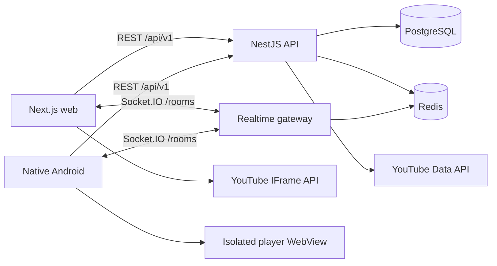

# Architecture

Video Together uses an authoritative server model. REST owns identity, room resources, invitations, history, and system state. Socket.IO owns short-lived presence, chat fan-out, playback intents, acknowledgements, and reconnect snapshots. PostgreSQL is the durable store; Redis is the cache, rate-limit substrate, ephemeral room-state store, and horizontal fan-out layer.

The server is the room clock authority. A host intent increments a monotonic sequence. Clients acknowledge, compensate for measured latency, and ignore stale events. See [synchronization](SYNCHRONIZATION.md).

Credential-free development deliberately uses an in-process store and YouTube metadata fallback. Production mode fails readiness when required infrastructure is unavailable; it never silently downgrades.
